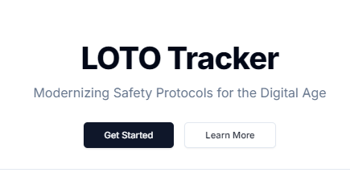
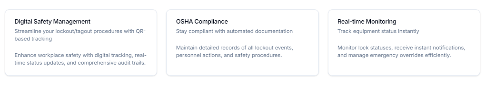

# LOTO Tracker

Modern Safety Protocol Management for the Digital Age



## Overview

LOTO Tracker is a comprehensive digital system designed to modernize safety protocols and improve compliance with OSHA standards. Using QR codes for tagging and tracking, the app provides a streamlined interface for managing lockout events, equipment statuses, and personnel actions.

## Features



- **Digital Safety Management**: Streamline your lockout/tagout procedures with QR-based tracking
- **OSHA Compliance**: Stay compliant with automated documentation
- **Real-time Monitoring**: Track equipment status instantly
- **Comprehensive Audit Trail**: Maintain detailed records of all system actions
- **Role-based Access Control**: Secure, granular permissions system
- **Mobile-First Design**: Fully responsive interface for all devices
- **Dark/Light Mode**: Comfortable viewing in any environment

## Tech Stack

- **Frontend**: Next.js 14 with TypeScript
- **Styling**: Tailwind CSS with shadcn/ui components
- **Database**: Neon.tech PostgreSQL
- **ORM**: Prisma
- **Authentication**: NextAuth.js

## Getting Started

### Prerequisites

- Node.js 18.x or later
- npm 9.x or later
- Git

### Installation

1. Clone the repository:

   ```bash
   git clone https://github.com/yourusername/lototrak.git
   cd lototrak
   ```

2. Install dependencies:

   ```bash
   npm install
   ```

3. Set up environment variables:

   ```bash
   cp .env.example .env
   ```

   Update the `.env` file with your configuration.

4. Initialize the database:

   ```bash
   npx prisma migrate dev
   ```

5. Seed the database:

   ```bash
   # Create default user (bob@bob.bob) with 2 locks
   npx prisma db seed

   # Create default user + 5 random users (each with 1-3 locks)
   npx prisma db seed -- --use-faker

   # Create default user + specific number of random users
   npx prisma db seed -- --use-faker --count 10

   # Clear existing data before seeding
   npx prisma db seed -- --clear --use-faker
   ```

   The default user credentials are:

   - Email: bob@bob.bob
   - Password: bob

6. Start the development server:

   ```bash
   npm run dev
   ```

7. Open [http://localhost:3000](http://localhost:3000) in your browser.

## Development

### Available Scripts

- `npm run dev` - Start development server
- `npm run build` - Build for production
- `npm start` - Start production server
- `npm run lint` - Run ESLint
- `npm run test` - Run tests

### Project Structure

```
lototrak/
├── app/              # Next.js app directory
├── components/       # React components
├── lib/             # Utility functions and configurations
├── public/          # Static assets
└── prisma/          # Database schema and migrations
```

## Contributing

1. Fork the repository
2. Create your feature branch (`git checkout -b feature/amazing-feature`)
3. Commit your changes (`git commit -m 'feat: add amazing feature'`)
4. Push to the branch (`git push origin feature/amazing-feature`)
5. Open a Pull Request

## License

This project is licensed under the MIT License - see the [LICENSE](LICENSE) file for details.

## Acknowledgments

- [Next.js](https://nextjs.org/)
- [Tailwind CSS](https://tailwindcss.com/)
- [shadcn/ui](https://ui.shadcn.com/)
- [Prisma](https://www.prisma.io/)
- [NextAuth.js](https://next-auth.js.org/)
